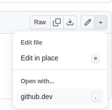

# markdownについて

- githubでmdファイルはmarkdownとして表示するもよう.

## 表

| 指定なし | 左詰め | 中央 | 右詰め |
|----|:---|:--:|---:|
| aaa | bbb | ddd | ddd |
| a | f | g | h |
| 1 | 2 | 3 | 4 |

## 外部リンク

- [Yahoo Japan](http://www.yahoo.co.jp)
- "target=_blank"には対応していないもよう.

## 内部リンク

- [Page 01](./page.01.md)

## コードブロック

```html
<a href="http://www.yahoo.co.jp" target="_block">Yahoo Japan</a>
```

## 取り消し線

- ~~取り消し戦~~

## 画像

[]

